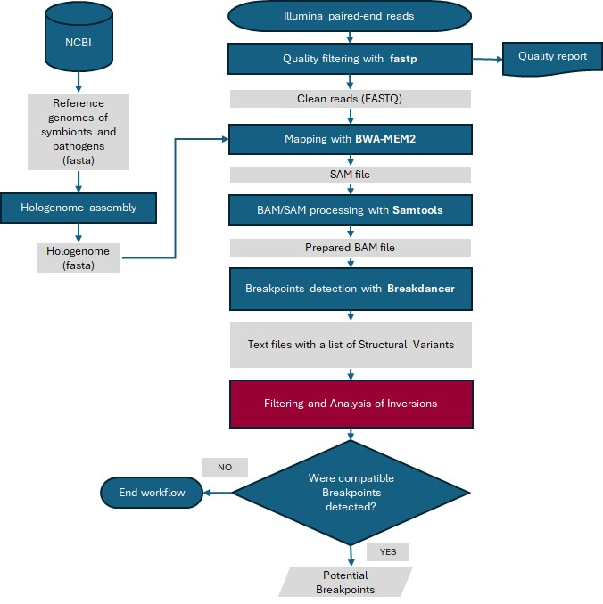
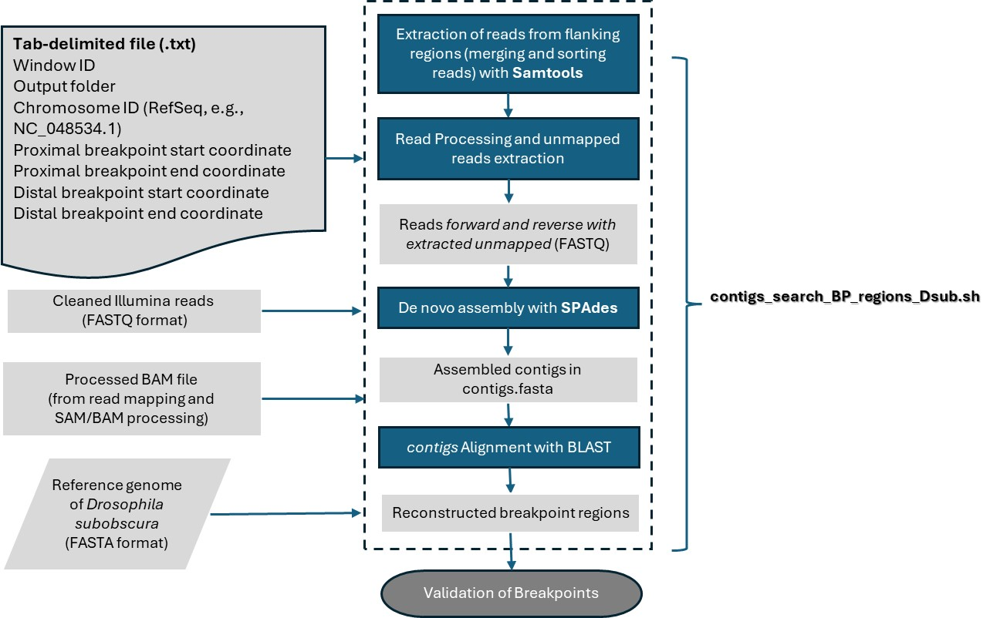

# Detection of chromosomal inversions in *Drosophila subobscura*

## Overview

The aim of this GitHub repository is to provide a bioinformatics pipeline for detecting chromosomal inversions in *Drosophila subobscura* using whole-genome sequencing (WGS) data from Illumina paired-end reads. This pipeline performs read quality control, mapping, structural variant detection, and breakpoint identification.

The workflow follows these main steps:

1. Hologenome assembly: The hologenome is built using reference genomes of symbionts and pathogens.
2. Quality control and filtering: Using fastp, raw Illumina reads are filtered to remove low-quality sequences.
3. Read mapping: Reads are aligned to the hologenome using bwa-mem2.
4. SAM/BAM processing: The mapped reads undergo post-processing with samtools (sorting, fixing mates, removing duplicates, and indexing).
5. Structural variant detection: Structural variants and breakpoints are identified using Breakdancer.
6. Filtering and analysis of inversions: The results are analyzed to determine potential chromosomal inversions.

## **Further Analysis: Extracting and assembling reads from breakpoint regions**

Once the regions of interest have been identified from structural variant detection, the next step is to extract and assemble reads from these breakpoint regions.

**Purpose:**  
  - Extract reads mapped to the identified breakpoint regions.
  - Retrieve discordant reads that may indicate chromosomal rearrangements.
  - Perform de novo assembly of breakpoint regions to identify potential inversion events.
  - Align contigs to the refernce genome to identify breakpoint regions. 

